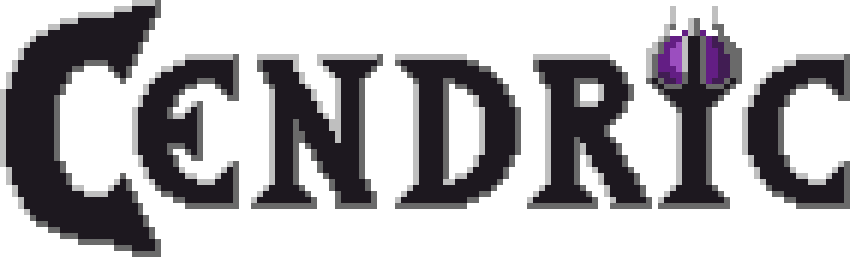

# Cendric - RPG Platformer

*Cendric* combines RPG and Platformer elements in one game, featuring both a sidescroller and top-down view. The player follows the story of a boy with no memory and discovers the magical but dangerous world of Admantris.

## Development and Release

The Steam page for Cendric is online: 
http://store.steampowered.com/app/681460/Cendric/

Release is planned for February/March 2018

The game is currently still in development. See http://en.sfml-dev.org/forums/index.php?topic=19740 for more information about its development process.

## Screenshots

For the newest screenshots, check out http://cendric.ch/screenshots.

## Gameplay

Cendric moves through the world on a 2D map and interacts with NPCs to trade or accept quests. At certain places, he can enter levels in which he fights enemies, collects items and completes tricky platforming challenges. To accomplish all this, Cendric can master various spells from different classes of magic.

## Features

- Interactive Levels: Some of Cendric's spells affect the levels and change his surroundings in the levels.
- Modifiable Spells: All spells can be modified using gems to make them stronger or behave in new ways.
- Special Effects: The game contains particle effects, a water simulation and simple lighting.
- Localization: All texts in the game are available in English, German and Swiss German.


## Current stable build

Pre-alpha builds are available for Windows x64, macOS and Ubuntu. However, feel free to try and compile *Cendric* on any platform.

[Cendric v0.9.0](https://github.com/tizian/Cendric2/releases/download/v0.9.0/Cendric_v0.9.0_win64.zip) (Windows x64)

[Cendric v0.9.0](https://github.com/tizian/Cendric2/releases/download/v0.9.0/Cendric_v0.9.0_mac.zip) (macOS)

[Cendric v0.9.0](https://github.com/tizian/Cendric2/releases/download/v0.9.0/Cendric_v0.9.1_ubuntu64.tar.gz) (Ubuntu x64)


A list of all builds is available [here](https://github.com/tizian/Cendric2/releases).

## How to compile

The recommended way to compile the code is to use [**cmake**](https://cmake.org/), which automatically generates project files for your favourite IDE or build system:
```
git clone https://github.com/tizian/Cendric2.git --recursive
cd Cendric2
mkdir build
cd build
cmake ..
```

## Used Libraries

* [SFML](http://www.sfml-dev.org/) : Window creation, rendering and sound
* [SQLite](https://www.sqlite.org/) : Database for translations and items
* [Lua](http://www.lua.org/work/) and [LuaBridge](https://github.com/vinniefalco/LuaBridge) : Scripting
* [TinyXML 2](http://www.grinninglizard.com/tinyxml2/index.html) : XML parsing

## License

<a rel="license" href="http://creativecommons.org/licenses/by-nc-sa/4.0/"></a><br />Game assets (images, and fonts) found in the "res" folder are licensed under a <a rel="license" href="http://creativecommons.org/licenses/by-nc-sa/4.0/">Creative Commons Attribution-NonCommercial-ShareAlike 4.0 International License</a>. Give attribution to Isa Roesch & Tizian Zeltner, if you're going to use them. 
The sound and music files found in the said folder are licenced under a CC0 (public domain) or a CC by SA licence. See the game's credits for the attribution notice. 
Tracks created by the main composer for the game, Matthew Harnage, can only be used with his explicit permission as well as the permission of Isabelle Roesch.
Tracks created by Susanne Aubert and Isabelle Roesch can only be used with their explicit permission.

